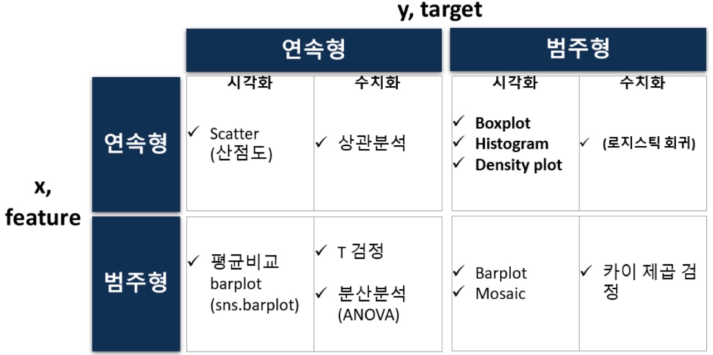

# 데이터 분석 및 의미 찾기 

## 교육 일자
2022년 8월 10일 ~ 12일  

## 목차  

### - EDA 1단계 : 단변량 분석 
  * matplotlib  
  * 분석 프로세스 : EDA, CDA   
  * 단변량 분석 : 숫자형 변수, 범주형 변수
  
### - EDA 2단계 (+ CDA) : 이변량 분석 
  * seaborn  
  * 이변량 분석 : 숫자 vs 숫자  
  * 이변량 분석: 범주 vs 숫자
  * 이변량 분석 : 범주 vs 범주
  * 이변량 분석 : 숫자 vs 범주     
  

## 요약  

### matplotlib 
  * **plt.plot**(x, y)
  * 범례 : **plt.xlable**, **plt.ylable** => **plt.legend()**를 써줘야 보여짐
  * 축 범위 : **plt.xlim**(시작값, 끝값), **plt.ylim**(시작값, 끝값)
  * 그래프 크기 : plt.figure(figsize=(가로, 세로))
  * 선 추가 : **plt.axhline**(y값, color, linestyle), **plt.axvline**(x값, color, linestyle)
  * 텍스트 : plt.text(x좌표, y좌표, 텍스트)
  * 그래프 여러 개 나눠서 : **plt.subplot**(행, 열, index)
  * **plt.show()** 그래프 표시  
  
### 데이터 분석 방법론 : CRISP-DM
　① **Business Understanding** : 비즈니스 문제 정의 > 데이터 분석 목표 설정 > 초기 가설 수립 (X -> Y)  
　② **Data Understanding** : 데이터 원본 식별 (어디 있는지, 취득 가능 여부) > 데이터 탐색 (EDA, CDA)  
　　- EDA (Exploratory Data Analysis) : 데이터 탐색 > 패턴 파악 > 인사이트 도출  
　　- CDA (Confirmatory Data Analysis) : 설정한 가설을 통계적 분석을 통해 검증(검정)  
　③ **Data Preparation** : 모델링을 위한 데이터 구조 만들기   
　　- Feature Engineering, 결측치 처리, 가변수화(Dummy variable), scaling 등을 수행해 정제된 DataFrame을 만든다  
　④ **Modeling** : 학습, 검증  
　⑤ **Evaluation**  
　　- 모델에 대한 최종 평가(using test set) : 오차, 정확도 등 기술적 관점 평가  
　　- 비즈니스 기대 가치 평가 : 실제 비즈니스 문제를 해결했는지 평가   
　⑥ **Deployment** : 배포 후 모델 성능을 계속 모니터링 해주어야 함 => 데이터 수집 ~ 모델 배포 관리까지 pipeline으로 구성  
  
### 데이터 분석 프로세스 : EDA & CDA
  * **EDA** : 탐색적 데이터 분석 : 비즈니스 문제 이해를 위해 : 그래프, 기초통계량
  * **CDA** : 확증적 데이터 분석 : 가설 검증(검정)을 위해 : 가설 검정 방법, 실험
  * **어떤** 도구를 **언제** 사용하고, 그 결과를 **어떻게** 해석하는지 중요하다
  
__ __ __ __ __ __ __

### CRISP-DM ② Data Understanding 중 EDA & CDA
 * ① 개별 변수 분포
 * ② 가설 (X->Y) 검정
 * ③ 전처리 전략 수립  

### ① 개별 변수 분포
  
|                       |          기초 통계량         |               시각화              |
|:---------------------:|:----------------------------:|:---------------------------------:|
|  숫자형 (양적 데이터) |  min, max, mean, std, 4분위수 | Histogram, Density plot, Box plot |
|  범주형 (질적 데이터) |   범주별 빈도수, 범주별 비율  |        Bar chart, Pie chart       |
  
#### 단변량 분석 
  * 숫자형 데이터 (Numerical data)
    * 기초 통계량 : 평균, 중위수, 최빈값, 4분위수
    * 시각화 
      - **Histogram** : plt.hist(1차원 data, bins, edgecolor) : **구간 개수(bins)**가 중요하다 
      - **KDE plot** (밀도함수 그래프) : sns.kdeplot(data) : **확률**을 **추정**할 수 있다
      - **Box plot** : plt.boxplot(data, vert) : **이상치** 판별 가능  

  * 범주형 데이터 (Categorical data)
    * 기초 통계량 : **범주별 빈도수**(df['col'].value_counts()), 
    **범주별 비율**(df['col'].value_counts()/len(df['col']))
    * 시각화
      * **Bar chart** : 집계 작업(범주 이름, 값) > Bar chart 그리기(plt.bar(index, values))  
      +) sns.countplot(df['col']) 쓰면 집계 작업 자동으로 해줌!
      * **Pie chart** : 범주별 비율 확인 : plt.pie(values, labels, autopct)

### ③ 전처리 전략 수립
 * 결측치 처리
  * 삭제　 **행** - NaN 건수가 적고, 운영에서 다시 NaN이 발생 X 일 때  
　　　**열** - NaN 건수가 많거나, 해당 변수가 중요하지 않을 때
  * 채우기 : 비즈니스 관점으로 결정 (맘대로 평균값, 중간값 등으로 채우면 X)
 * 가변수화(Dummy Variable) : 범주 -> 숫자화
 * 스케일링(optional)
 * Feature Engineering : 기존 컬럼으로 새로운 컬럼 만들기 => 비즈니스 관점으로 결정 
#### => 결과물　1) 모든 셀은 값이 있어야 한다 (결측값 처리)
#### 　　　　　2) 모든 값은 숫자여야한다 (가변수화)
#### 　　　　　3) 필요에 따라 숫자의 범위를 일치시킨다 (스케일링)

### ② 가설 (X->Y) 검정

#### 이변량 분석 (x,feature vs y,target)
  * **숫자 vs 숫자**
   * **산점도** : Linearity!
   * **상관분석** : 상관계수(r), p-value
    * 한계 : 기울기 모름, 직선의 관계만 볼 수 O

  * **범주 vs 숫자**
   * **평균 비교** : 이때 평균값이 그 집단을 대표할 수 있는지, 그 평균값이 믿을 만 한지 고려해야 함!
    * 평균값이 그 집단을 대표할 수 있는가? : 정규분포와 유사한 형태의 분포일 때 => 대표 O
    * 평균값이 믿을 만 한가? : 표준편차, 표준오차
     * **표준편차** : 대푯값 = 평균일 때, 값들이 평균으로부터 얼마나 벗어나 있는지(이탈도 deviation)를 나타내는 값
     * **표준오차** : 표본평균과 모평균의 오차 => 이때 중심극한정리로 모평균을 추정할 수 있다

  * **범주 vs 범주**
   * ㅇㅇㅇ

  * **숫자 vs 범주**
   * ㅇㅇㅇ

